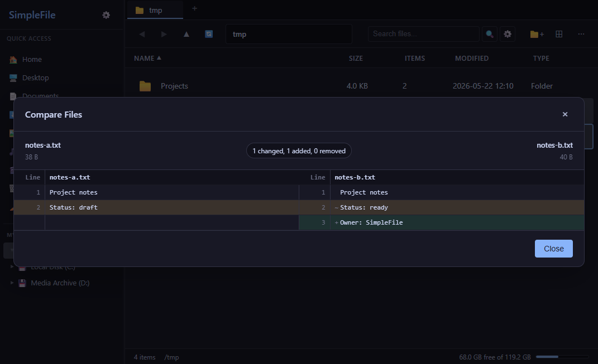
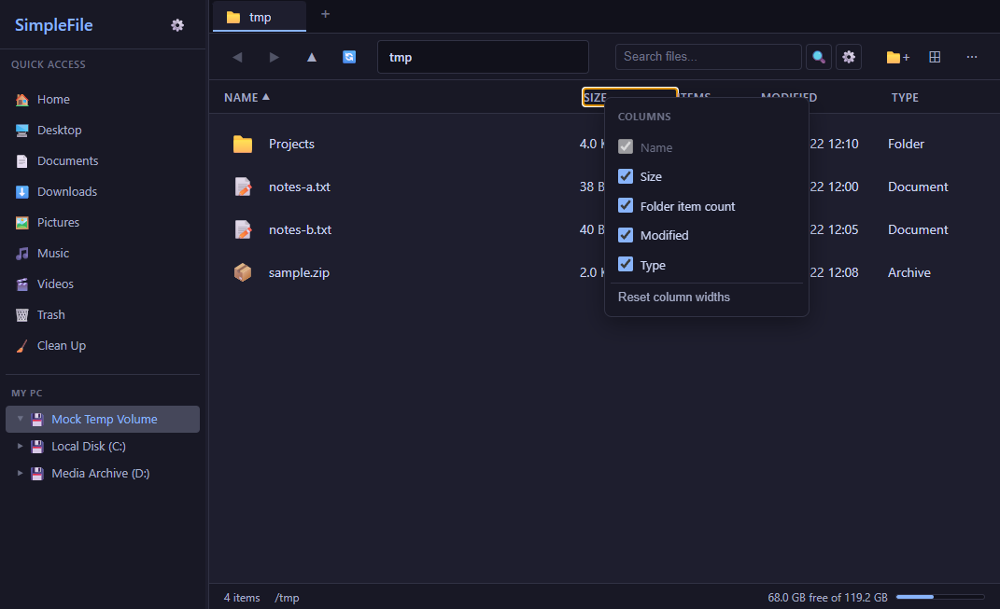

# SimpleFile

SimpleFile is a Windows-focused desktop file manager built with Tauri, Rust, and Svelte. This branch is scoped to local files, Windows drives, mapped network drives, archives, search, previews, metadata, Git status, cleanup tools, and signed Windows installers.

## Current Windows Release Scope

- Dual-pane and tabbed browsing for local folders.
- Windows drive listing with volume labels, mapped network drive names, and native drive types.
- In-app folder navigation from file lists, breadcrumbs, Quick Access, and the tree view.
- Conflict-aware copy and move operations with progress, cancellation, keep-both, replace, and skip flows.
- Archive creation, listing, and extraction for common formats.
- Advanced rename, quick filtering, recursive search, smart folders, file labels, and clipboard history.
- Preview, Quick Look, thumbnails, checksums, EXIF metadata, symlink handling, folder size, and item counts.
- Git status display plus pull and push commands where a folder is inside a repository.
- Windows terminal and elevated PowerShell launch actions.
- Signed updater metadata and Windows installer outputs for NSIS and MSI.

This branch does not include app-managed provider integrations or provider-backed mount workflows. Windows mapped network drives remain supported as normal Windows drives.

## Screenshots

| Advanced Rename | File Comparison |
| --- | --- |
|  |  |

| Configurable Columns |
| --- |
|  |

## Requirements

- Windows 10 or later for the supported desktop release target.
- Node.js 24 or newer.
- Rust stable and the Tauri prerequisites for Windows.
- Optional: RAR tooling can be installed from Settings when needed for RAR archive workflows.

## Development

Install frontend dependencies:

```powershell
npm ci --prefix frontend
```

Run the app in development:

```powershell
npm run dev
```

Run the standard check gate:

```powershell
npm run check
```

Run Rust checks:

```powershell
npm run check:rust
```

Build Windows installers locally:

```powershell
npm run build:tauri:local
```

## Verification

The main release checks are:

```powershell
npm run check
npm run check:rust
npm run check:security
npm run check:release
npm run build:tauri:local
npm run smoke:settings
npm run smoke:release
npm run smoke:msi
npm run smoke:installer
```

`npm run check` includes a provider-surface guard that fails if retired provider UI, command contracts, docs, or setup text reappear outside historical changelog notes and generated syntax-highlighter data.

## Project Layout

- `frontend/src/main.ts` starts the Svelte app.
- `frontend/src/lib/components/` contains Svelte components.
- `frontend/src/lib/app/` contains workflow orchestration.
- `frontend/src/lib/api.ts` and `frontend/src/lib/tauri.ts` define the typed Tauri command boundary and browser-dev fallback.
- `frontend/src/vanilla-js/runtime/` contains live plain JavaScript state helpers that are still shared by the Svelte app.
- `frontend/src/vanilla-js/generated-svelte/` contains generated migration-audit artifacts.
- `src-tauri/src/` contains Rust commands for filesystem, archive, preview, search, metadata, Git, cleanup, updater, and Windows drive behavior.
- `.github/workflows/` contains CI and release automation.

## Packaging

`src-tauri/tauri.conf.json` targets Windows installer bundles only:

- NSIS installer.
- MSI installer.

Updater metadata is generated for the Windows release channel. The updater uses passive install mode on Windows.

## Security

Do not commit signing keys, local `.env` files, updater private keys, or personal settings files. See [docs/SECURITY.md](docs/SECURITY.md) for reporting and release-security details.
